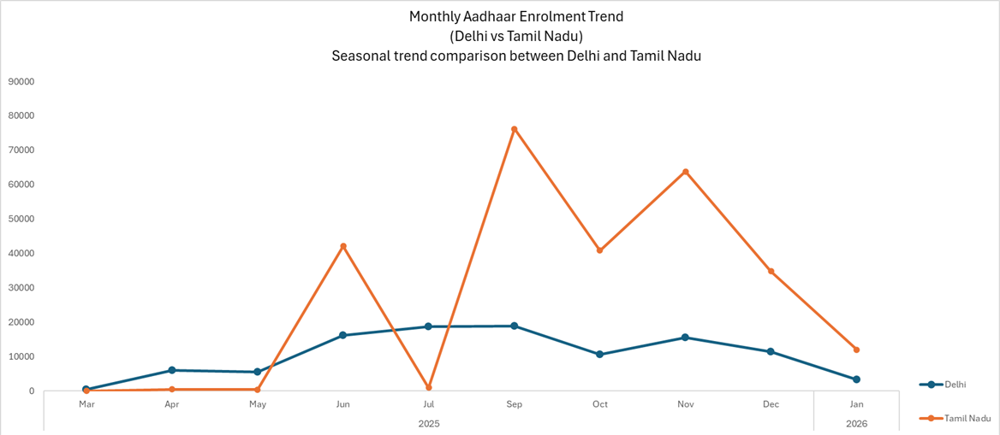
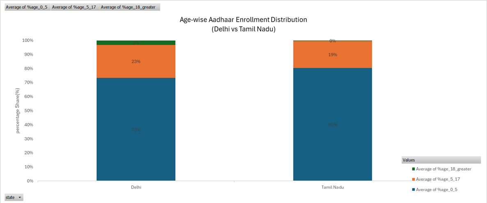

# UIDAI-Aadhaar-Delhi-vs-TamilNadu (Hackathon 2026)
Comparative Analysis of Aadhaar Enrolment & Updates  
### Delhi vs Tamil Nadu | UIDAI Data Hackathon 2026

##  Project Overview  
This project presents a comparative data analysis of Aadhaar enrolment and update trends in two Indian regions: *Delhi* and *Tamil Nadu*. The objective is to understand how demographic and regional factors influence Aadhaar registration and update behavior.

##  Dataset  
Data sourced from the *UIDAI Open Data Portal*.  
Includes:  
* Monthly enrolment data  
* Age-wise enrolment distribution  
* State-wise Aadhaar activity for Delhi and Tamil Nadu  

##  Tools & Technologies  
* Microsoft Excel  
* Power BI (if you used it — remove if not)  

##  Analysis & Visualisation  
* Monthly Aadhaar Enrolment Trend (Delhi vs Tamil Nadu)  
* Age-wise Aadhaar Enrolment Distribution  
* Comparative insights using line and stacked bar charts  

##  Key Insights  
* Tamil Nadu exhibits higher variability in monthly enrolments, indicating seasonal or drive-based registration efforts.  
* Delhi shows a comparatively stable enrolment pattern, suggesting consistent administrative processes.  
* Certain months reflect noticeable enrolment peaks in Tamil Nadu compared to Delhi.  
* The 0–5 age group accounts for the largest share of enrolments in both states.  
* The 5–17 age group contributes a moderate proportion, influenced by school-based initiatives.  
* Enrolments for individuals aged 18 and above form a smaller share.

##  Outcome  
This project demonstrates how public Aadhaar data can be analyzed to generate insights that support governance, service improvement, and regional planning.

## Visualizations

## 👤 Author  
Ashylin – Data Analytics / AI Student
